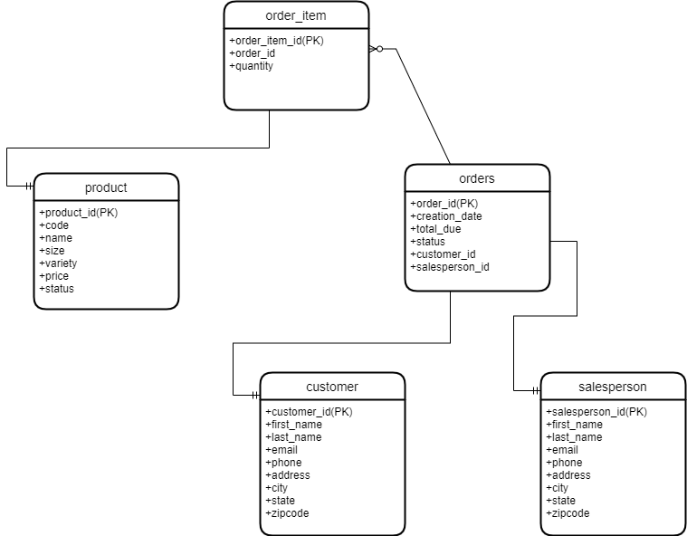

# Introduction
Developed and implemented a simple JDBC application in order for a Java program to make a connection to a Postgres database. PostgreSQL database instance provisioned using a Docker container. The objective of this project was to implement a DAO to be able to better understand the CRUD operations using one or any number of tables in the database. The project is managed and built using Maven.

# Implementaiton
## ER Diagram

## Design Patterns
`DAO Pattern: `

DAO stands for Data Access Object. DAOs provide an abstraction layer between raw JDBC code and the rest of the code specifically, the business logic. This way, the service remains completely in dark about how the low-level operations to access the database are done. This is known as the principle of Separation of Logic.

`Repository Pattern: `

The alternate pattern would be the repository pattern which is especially popular in the web world. The repository pattern focuses only on single-table access per class. In this project, the CustomerDAO could be counted as a repository since we are only interacting with the customer table. Moreover, in the repository pattern joining happens in the code instead of the database. Distribution is where repositories show their strength. Complex joins in the database require a single instance of the database themselves which requires vertical scaling of the database. However, when distributing around the world, vertical scaling does not always work, and the repository pattern allows you to shard your database in a way that you can focus on single table access instead of accessing the database as a whole.

# Test
The database and tables were set up and filled with sample data prior to the implementation. The tests were done manually in JDBCExecuter class and results were compared to the expected results.