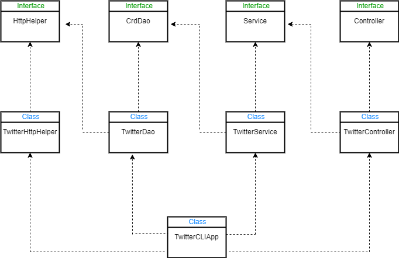

# Introduction
Developed and designed a Java program for users to post, show and delete tweets from the command line. This program uses an HTTP client to interact with the Twitter REST API. The main objective of this project was to get comfortable with technologies such as REST APIs and Java libraries such as Apache HTTP Components and Signpost OAuth library to authenticate and send requests to Twitter REST API as well as Jackson for parsing and processing JSON. Additionally, Junit and Mockito libraries were used for Integration and unit testing. The dependencies were managed using Maven and SpringBoot and the project has been deployed on DockerHub.

# Quick Start
- Packaging using Maven
  ```
  mvn clean package
  Java -jar target/twitter-1.0-SNAPSHOT.jar post|show|delete ARGUMENTS
  ```
- Run using Docker
  ```
    docker pull alisbi/twitter
  
    docker run -rm\
    -e consumerKey= USER_KEY
    -e consumerSecret= USER_SECRETE
    -e accessToken= USER_ACCESS_TOKEN
    -e tokenSecrete= USER_TOKEN_SECRETE
    alisbi/twitter post|show|delete ARGUMENTS

  ```

# Design

---
## UML diagram



`TwitterDao:` This class is responsible for interacting with the Twitter REST API by constructing the corresponding URIs and making the HTTP request.

`TwitterService:` This class is responsible for handling the business logic of the program. In this layer, the program checks if the length of the tweet is in the range specified and if the ID format is correct as well as calling the DAO layer.

`TwitterController:` This class is responsible for parsing the user input as well as calling the Service layer methods.

`TwitterCLIApp:` This class is responsible for initializing the dependencies, taking the command line arguments, and redirecting them to the corresponding methods in the Controller layer.

## Models
Created a simplified version of the Tweet object using 5 classes:

`Coordinates:` Holds the Latitude and Longitude of the user's location.

`Entities:` Holds Hashtags and User-Mentions.

`Hashtag:` Holds the hashtags of the Tweet.

`UserMention:` Holds the mentioned users in the tweet

`Tweet:` The simplified version of the Tweet object using the above components.

```
Sample Tweet:

{
   "created_at":"Mon Feb 18 21:24:39 +0000 2019",
   "id":1097607853932564480,
   "id_str":"1097607853932564480",
   "text":"test with loc223",
   "entities":{
      "hashtags":[],
      "user_mentions":[]
   },
   "coordinates":null,
   "retweet_count":0,
   "favorite_count":0,
   "favorited":false,
   "retweeted":false
}
```

## Spring
In TwitterCLIApp, the main method was used to create all components and set up the dependency relationship manually. It works fine for this case, but it can become really hard to manage if there are a lot of components and each one requires more than one dependency. As a result, Spring was used in order to manage dependencies automatically.
1.	`TwitterCLIBean:` This was the first approach in which @Bean annotations were used and the dependencies were passed through the method arguments. Further, an IoC container was used to automatically initiate all the beans and the specified dependencies.
2.	`TwitterCLIComponentScan:` The first approach leads to repetitive manual work. Therefore, In this approach @Autowired annotations were used in order for the IoC container to inject dependencies.
3.	 `TwitterCLISpringBoot:` Lastly in this approach, the TwitterCLIApp was configured with SpringBoot.


# Test
In this project both Unit and Integration, testing was performed using the Junit library to ensure that the program will perform correctly. Unit testing was performed using the Mockito library in order to make sure each component works in Isolation. Integration testing was performed to ensure that classes and their dependencies will perform as expected.

## Deployment
A DockerFile was used to make an image of the program. Further, the program has been deployed on DockerHub.

```
FROM openjdk:8-alpine
COPY target/twitter*.jar /usr/local/app/twitter/lib/twitter.jar
ENTRYPOINT ["java","-jar","/usr/local/app/twitter/lib/twitter.jar"]
```


# Improvements
- Allow users to update a tweet.
- Make a more complex version of the Tweet object with more components.
- Searching for tweets with other options such as text, the time created, … .