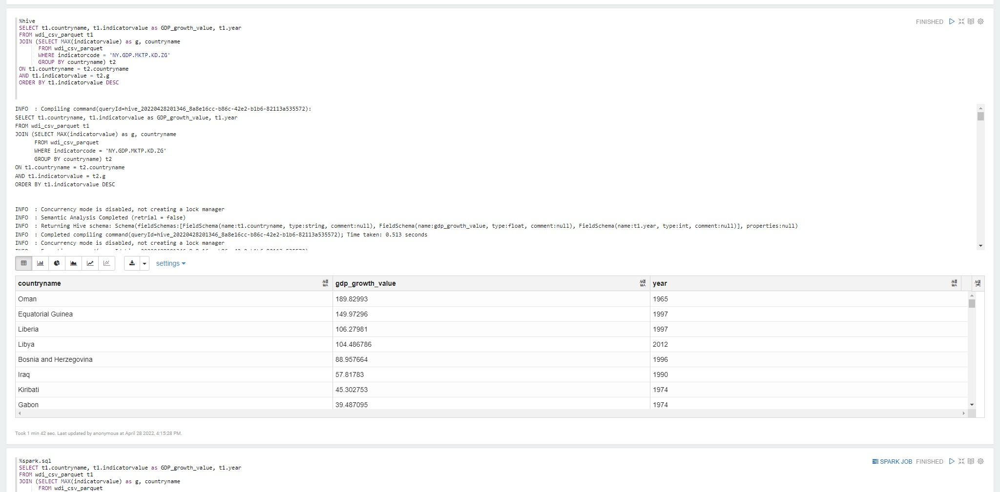

# Table of contents
* [Introduction](#Introduction)
* [Hadoop Cluster](#Hadoop Cluster)
* [Hive Project](#Hive Project)
* [Improvements](#Improvements)

# Introduction
The Jarvis Data Engineering team requested an analysis on a table called World Development Indicator (WDI) taken from Googles BigQuery. The main objective of this project was to first, learn core Hadoop concepts: HDFS, MapReduce, Yarn, and second, to analyze data using Hive and Zeppelin on a Hadoop cluster created using Google Cloud dataproc.

# Hadoop Cluster

### Big data tools:
 
- `HDFS:` Hadoops fault-tolerant distributed file system that handles large data sets.
- `YARN:` Hadoops resource manager was made by splitting the processing engine and the management function of MapReduce.
- `MapReduce:` A programming paradigm that allows users to process data using mappers and reducers.
- `Tez:` Tez improves the MapReduce paradigm by dramatically improving its speed while maintaining MapReduce's ability to scale to petabytes of data.
- `Hive:` Allows users to manage huge amounts of data using HiveQL which is a heavily SQL-like language.
- `Zeppelin:` Web-based notebook which allows users to do data analysis on a Hadoop cluster.
  
The cluster was initialized with a master node and 2 worker nodes each with 2 CPUs, 12 GB RAM, and 100 GB of disk size.

# Hive Project
`Partitioning:` In order to improve the query performance, the data set has been partitioned (By year). Now that the data is stored in slices, the query response time becomes faster since we are not querying the whole dataset.

`Columnar File Optimization:` Stored data in the parquet format which stores data in columns instead of rows and is really efficient with queries requiring a value from each row in the dataset. Columnar storage can significantly reduce the amount of data fetched from disk by allowing access to only the columns that are relevant for the particular query or workload.
All the performance comparisons are stated inside the Notebook.

      

# Improvements
- Using more worker nodes can provide more resources which leads to faster execution time.
- In addition to partitioning and Columnar File Optimization, other optimization techniques can be utilized such as Bucketing, map joins, CBO, and Hive indexing to further optimize the queries.
- Switching to newer and faster technologies such as Apache Spark.
