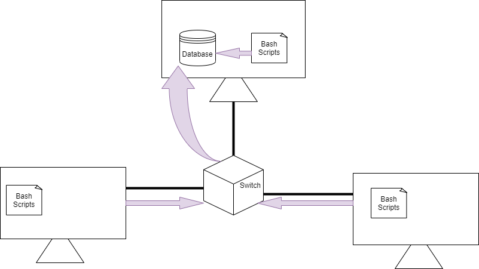

# Introduction
The Objective of this project is to design an MVP in order to gather hardware specifications and resource usage of each node in a Linux cluster. In Jarvis, the Linux cluster administration team manages a Linux cluster of 10 nodes running Centos7. These nodes are internally connected through a switch and able to communicate through internal IPv4 addresses. The administration team has requested a bash agent program that is installed on each node and gathers the requested data. The collected data is inserted into a Postgres database instance which is pulled from Docker Hub. Moreover, the LCA team will use the data to generate reports for future resource planning purposes. In order to make decision making easier, a queries file has been created for the administration team to see what nodes have the highest memory and number of CPUs, what is their usage over a 5 minute interval and detecting failures. 

# Quick Start

- bash ./scripts/psql_docker.sh start
- psql -h localhost -U postgres -d host_agent -f sql/ddl.sql
- bash ./scripts/host_info.sh localhost 5432 host_agent postgres password
- bash ./scripts/host_usage.sh localhost 5432 host_agent postgres password
- Crontab -e *****

# Implemenation
The bash agent program consists of two bash scripts: host_info.sh and host_usage.sh.
- The host_info.sh will collect the hardware specifications ( CPU number, CPU architecture, L2 cache, Memory, etc. )  of each node.
- The host_usage.sh will collect the resource usage (Free memory, CPU idle, CPU usage, disk IO, etc. ) of each node.

The collected data then, is inserted into a Postgres database instance.
## Architecture

## Scripts
Shell script description and usage (use markdown code block for script usage)
- psql_docker.sh: Used to start, stop or create a Postgres container.

- host_info.sh: Collects host's hardware specifications.

- host_usage.sh: Collects host's resource usage.

- crontab: Used to collect each host's resource usage every minute.

- queries.sql: Used to query through the database in order to show information in a human readable format as well as detecting any failure caused by each node by keeping track of the Cron job.

## Database Modeling

- `host_info` : id (PRIMARY KEY) | hostname | cpu_number | cpu_architecture | cpu_model | cpu_mhz | L2_cache | total_memory | timestamp

- `host_usage` : host_id (FOREIGN KEY references host_info primary key) | timestamp | memory_free | cpu_idle | cpu_kernel | disk_io | disk_available

# Test
Since this project is an MVP, I tested the program on my own machine. The tables are set, insertions work fine and corntab is inserting the usage every minute into the host_usage table. In addition to this, the program is written in a way that it would work on a cluster environment of course.

# Deployment
The program is deployed on GitHub and whoever downloads it could use it.

# Improvements
Write at least three things you want to improve
e.g.
- Handeling databases better
- Speed
- Using regex more
