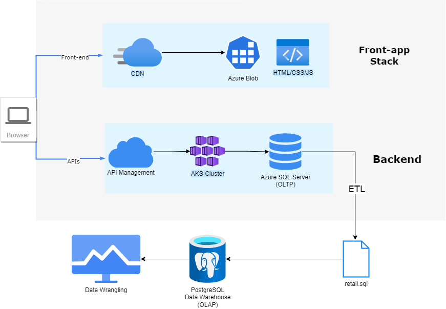

# Introduction
London Gift Shop, a UK-based online store, has been seeing revenue loss in recent years. Their marketing team would like to utilize the latest data technologies to better understand their customers and develop sales and marketing techniques. They decided to engage with Jarvis data engineering services and as a data engineer, I was responsible for delivering a proof of concept (POC) project that helps the LGS marketing by analyzing customer shopping behavior. The main objective of this project was to utilize Jupyter Notebook, Python libraries such as NumPy, Pandas, and Matplotlib for data analysis. In addition to this, the client retail data was loaded and used for analysis using a Postgres data warehouse.
# Implementaion
Since the project is a proof of concept, the Jarvis team is not allowed to work with the LGS Azure environment. As a result, the Jarvis team requested for transaction data from 01/12/2009 to 09/12/2011 in a SQL file. The retail data then is dumped into our Postgres data warehouse for analysis.
## Project Architecture

## Data Analytics and Wrangling

-	Visualized the distribution of invoice amount with min, max, median, mod, and mean.
-	Calculated and visualized monthly placed and canceled orders.
-	Calculated and visualized monthly sales.
-	Visualized monthly sales percentage growth.
-	Calculated and visualized monthly active users as well as new and existing users.
-	Founded RFM and RFM score for each customer using the unique CustomerID.
-	Created 11 different segments and assigned each customer to the corresponding segment for further analysis.

# Improvements
-	Analysis on a longer range of time.
-	Predicting future sales.
-	Analysis of other important factors such as products, customer feedback,  .
